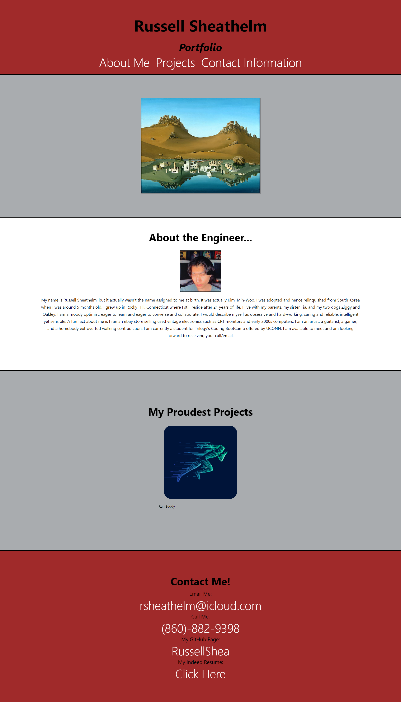

# Module II Advanced CSS Challenge: Portfolio

## Repo Description

This is the portfolio containing recent projects, about me section, and contact section.

## Deployed Page

Here are some features:

- When user hovers over clickable navigation, it appears golden and bold
- When user clicks navigation options, they are taken to the corresponding section in the webpage
- When user hovers over image, the opacity is much less to confirm a clickable event
- When user clicks image, they are taken to github repo
- When user clicks on any links in "Contact Me" section, they will be taken to the appropriate link in another tab
- When user rescales the window, the media and text will flex to allow a smoother view

## Contributions

- Horiseon web page created by [UCF Boot Camp](https://github.com/coding-boot-campurban-octo-telegram)
- Code refactoring by Russell Sheathelm [Russell's Github Page](https://github.com/RussellShea)
